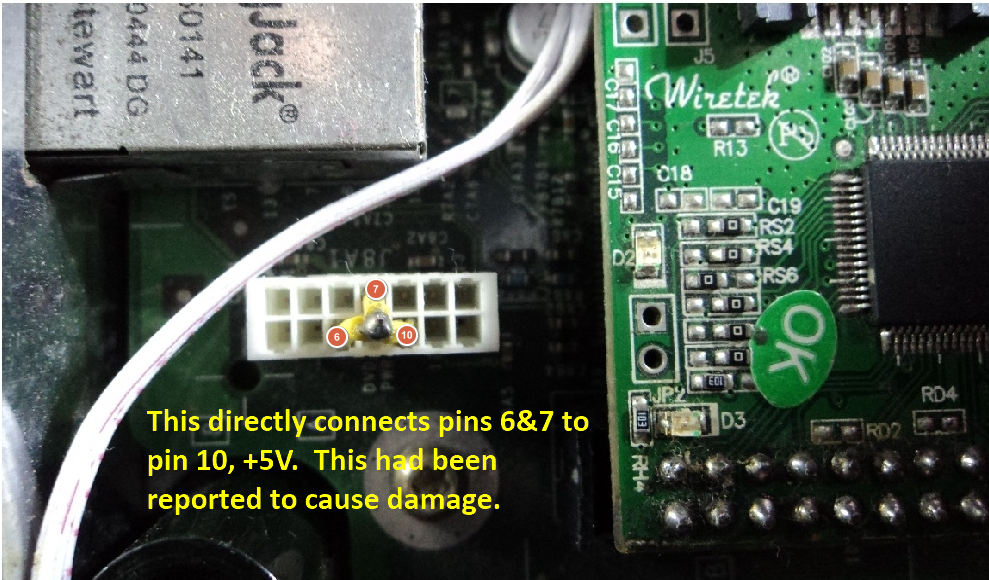
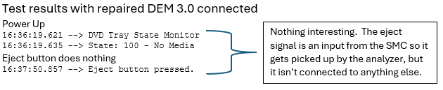

# OG Xbox DVD Drive State Analyzer and Elimination Circuit

## Table of contents

- [OG Xbox DVD Drive State Analyzer and Elimination Circuit](#og-xbox-dvd-drive-state-analyzer-and-elimination-circuit)
  - [Introduction](#introduction)
  - [Background and Motivation](#background-and-motivation)
  - [Hardware Setup](#hardware-setup)
    - [Connection Details](#connection-details)
    - [Signal Identification](#signal-identification)
      - [DVD Header](#dvd-header)
      - [SMC](#smc)
  - [Software (Arduino Code)](#software-arduino-code)
  - [State Diagram and Analysis](#state-diagram-and-analysis)
  - [DVD Drive Elimination Circuit](#dvd-drive-elimination-circuit)
    - [Option 1 - Voltage Divider](#option-1---voltage-divider)
    - [Option 2 - Pin 4](#option-2---pin-4)
    - [Easy DEM](#easy-dem)
  - [Non-Working Designs and Outdated Info](#non-working-designs-and-outdated-info)
    - [Bad Schematic](#bad-schematic)
    - [Xenium DEM 3.0](#xenium-dem-30)
    - [Bridging Pins 4 & 7](#bridging-pins-4--7)
    - [Cerbios Playbook v1.5 Option 1](#cerbios-playbook-v15-option-1)
    - [Cerbios Playbook v1.5 Option 2](#cerbios-playbook-v15-option-2)
    - [Cerbios Playbook v1.5 Option 3](#cerbios-playbook-v15-option-3)
    - [The Ubiquitous Drawing](#the-ubiquitous-drawing)
  - [Appendix: Test Results](#appendix-test-results)
    - [DVD drive connected](#dvd-drive-connected)
    - [Repaired DEM Connected](#repaired-dem-connected)
    - ["Easy DEM" Method](#easy-dem-method)
    - [Pins 4-7 only](#pins-4-7-only)
    - [Nothing Connected](#nothing-connected)

## Introduction

This project aims to accurately document the OG Xbox DVD drive's tray state signals, specifically to correct widespread inaccuracies regarding signal identification, implementation, and voltage levels. While the "100" solution for drive elimination is generally known, often referenced as TRAY_IN, CD_RDY, and TRAY_OUT (pins 7, 6, 5), many implementations rely on incorrect pinouts and voltage levels, leading to potential hardware damage. The correct signal names, as per the Xbox Motherboard Schematic, are TRAY_STATE2, TRAY_STATE1, and TRAY_STATE0.

A key objective was to verify that the DVD drive's output signals, which serve as inputs to the SMC (System Management Controller), operate at 3.3V. This was expected due to the SMC's use of a Microchip PIC16C63, which has a VDD of 3.3V, and the PIC's datasheet specifying input voltage levels within 0.3V of VDD.

## Background and Motivation

I discovered that the state diagram in the document "Xbox Hardware Design Specification 1.02" is incomplete and inaccurate. Utilizing a custom cable and an Arduino-based analyzer, I've developed an accurate state table and diagram. My motivation was to provide a definitive resource for understanding these signals, as existing methods often yielded correct results for incorrect reasons.

Initially, I observed inconsistencies with drive detection in UnleashX and XBMC4Gamers, despite using Cerbios with both the legacy and modern "no DVD" modes.  A purchased "drive elimination module," intended to resolve these issues, also failed to function, matching a flawed online schematic. Further research revealed numerous unreliable solutions, some of which could cause hardware damage.

## Hardware Setup

In order to simplify connections to the microcontroller and to check voltages while the DVD drive or other circuits are connected, I modified the original DVD power cable.  I spliced wires with female 0.1" DuPont connectors into the wires for pins 2-6.  This gave me access to +5V, ground, the eject input from the SMC, and the three tray_state outputs to the SMC.

### Connection Details

Modified DVD Cable:

Motherboard Connector Pinout:

Motherboard Connector:

DVD Drive Connector:

Test setup (cable close-up):

Test Setup:

### Signal Identification

Note the pin numbers for the 14-pin motherboard header correspond directly to the 12-pin DVD drive connector.  I.e., pin 1 is connected to pin 1, etc.  This may seem obvious but there are a lot of diagrams which use differing numbering schemes.  For this document, all pin numbers on schematics and physical connecters are consistent.

#### DVD Header

Note that DVDEJECT is an input to the DVD drive from the SMC.  The tray state lines are all outputs to the SMC from the DVD drive.  These are important things to consider regarding voltage and current.

#### SMC

The most important thing to note here is that VDD for the SMC is 3.3V!  This means the three inputs from the tray state lines of the DVD drive must be between 3.0V and 3.6V.  Voltages outside this range risk permanent damage to the SMC, and there a reports in various forums where people connected these lines directly to 5V and frying their motherboards.  The DVD_ACTIVE line has the same restrictions.  It isn't used in this analysis but it does come up later when looking at flawed schematics and products.

The eject switch on the console isn't connected directly to the DVD drive.  It sends an input to the SMC, which in turn sends a signal to the DVD drive.  This is normally held high by a 1KΩ resistor and the SMC briefly pulls it low when the eject button is pressed.  This makes it a useful source for 3.3V signals.

## Software (Arduino Code)

This Arduino code was developed to analyze and document the DVD drive's tray state signals. While primarily intended for research and validation, it provides a detailed record of the experimentation process. The code is provided for informational purposes, demonstrating the methodology used to arrive at the documented state table and diagram.

The code is in the /src folder.  I used an Arduino Leonardo clone for testing and an FTDI adapter to capture the data using a PC terminal program.  I used software serial since I powered the Arduino from the Xbox instead of USB from the PC.  I didn't want a USB connection from my PC to the Arduino because it would inject voltage from a second source.  Connection details are in the code.

## State Diagram and Analysis

Here is an updated stated diagram for a connected DVD drive.  This was derived directly by connecting a Thompson DVD drive and monitoring the signals while performing various functions.

| State | Description       |
| ----- | ----------------- |
| 000   | Detecting media   |
| 001   | Tray open         |
| 010   | Unloading         |
| 011   | Opening           |
| 100   | No media detected |
| 101   | Closing           |
| 110   | Media detected    |
| 111   | Initializing      |

## DVD Drive Elimination Circuit

The desired tray state for DVD drive elimination is 100 on pins 7,6, and 5.  The correct input voltage for the SMC is 3.3V.  There are 3.3V sources available in a few locations on the motherboard, but in order to keep everything confined to the DVD header there are two options.  

**Important Warning:** When designing or implementing a DVD drive elimination circuit, it is crucial to ensure that the output signals are at the correct voltage level (3.3V). *Applying higher voltages to the TRAY_STATE2, TRAY_STATE1, or TRAY_STATE0 pins can cause permanent damage to the Xbox's System Management Controller (SMC) or other motherboard components.* Always verify your circuit with a multimeter before connecting it to the Xbox.

### Option 1 - Voltage Divider

Use the 5V from pin 2 as the source for a voltage divider which outputs 3.3V.  

### Option 2 - Pin 4

Since it is only being used for signaling and not driving a load, it is also safe to use pin 4, which receives 3.3V from the SMC.

### Easy DEM

An easy way to implement option 2 is what I'm calling an "Easy DEM" (drive elimination module).  It only requires an original DVD power cable, a tiny flat-head screwdriver or similar tool, and a little patience.

1. Remove all of the pins from the 14-pin (motherboard end) connector **except** pins 4, 5, and 6.  Refer to the photo above -- odd pins are in the top row and even pins are on the bottom.  To do this, carefully pry the little plastic tab with your screwdriver and pull out the pin by pulling on the wire.
   
   

2. Remove pins 4,5, and 6 from the 12-pin (DVD drive end) connector.
   
   

3. Insert the other end of the wires from positions 4-6 as follows.  Be sure the tiny metal protrusion is facing the locking tab.
   Pin 4 --- Pin 7
   Pin 5 -- Pin 11
   Pin 6 -- Pin 12
   
   

## Non-Working Designs and Outdated Info

> [!NOTE]
> 
> All of my testing was done using Cerbios 2.4.2.  When I contacted the seller of the bad module, they said they had not seen any issues in their own testing or heard from other customers.  They tested the module using Stellar and Evox (TSOP) with mixed results, so it is possible different BIOSes interact with the SMC differently.  Nonetheless, because of my direct analysis of the signals and voltages I am confident that my conclusions for a proper drive elimination circuit are correct.

### Bad Schematic

As mentioned previously, this all started when I received a module I purchased as part of a DVD elimination kit.  I plugged it into my DVD cable but it didn't work -- both XBMC4Gamers and UnleashX reported the DVD drive as open, regardless of which "No DVD" mode I used for Cerbios, legacy or modern.  I reverse engineered the module to see it there was a bad connection and found it matched a schematic I found online.  The problem is the schematic is wrong.  

No disrespect to WireOpposite, but this is the source of the incorrect schematic.  Details are in the issue I logged [here](https://github.com/wiredopposite/XND/issues/1).  Interestingly, the module I received had the exact same issue and the exact same fix -- to solder the connector from the opposite side of the board to effectively swap pin 1 (+12V) and 2 (+5V) and swap pins 7 (TrayState2) and 8 (DVD_Active).  Flipping the connector actually swaps all of the even and odd pins but since 5 and 6 are both grounded it doesn't change anything.  Here is the schematic:

Problems with this circuit:

- This creates a voltage divider sourced by the +12V pin (1), so with voltage going into pin 8 is +8V, i.e. $V_{out} = \frac{R_2}{R_1 + R_2} \cdot V_{in}$. Sourcing it from the +5V pin (2) produces the correct +3.3V.  
- Pin 8 is the DVD_Active pin (labeled incorrectly above).  This is an input to the SMC which is running with a VDD of 3.3V so +8V is far above the maximum ~3.6V specified by the datasheet.  I think my SMC was spared from damage because the theoretical maximum output from this voltage divider is 400µΩ.
- Pin 4 is connected to ground.  This is an output from the SMC, so this is also puts the SMC in peril.  According to the schematic, this pin normally held high by a 1KΩ resistor so this may be what saved the SMC here.

### Xenium DEM 3.0

Here is the DEM I purchased.  The module needed to be repaired because it matched the bad schematic above, which had the 5V and 12V inputs, and the DVD_Active and Tray_State2 outputs swapped.  I fixed it by desoldering the connector and soldering it to the other side of the board, taking care to ensure pin 2 was connected to +5V.  (Technically, there are four ways to insert the connector, so if you have one of these modules and decide to change it, take care to align it properly.)

### Bridging Pins 4 & 7

This method shouldn't cause any damage and it technically works, but it is "noisy" since it leaves pins 5 & 6 open rather than connecting them to ground.  Here is a picture of that solution.

### Cerbios Playbook v1.5 Option 1

This is from the underside of the motherboard.  It does generate the closed-empty (100) state but the voltages are wrong.  It might not cause immediate damage to the SMC because of the current-limiting resistors, but it causes undue stress on the PIC chip.

### Cerbios Playbook v1.5 Option 2

This directly connects +5V to pins 6&7.  It has been reported to cause damage.  Again, these are inputs for the SMC so they should be 3.3V.  Furthermore, if it worked this would report the media detected (110) state to the SMC.  Reporting that state with the correct voltage might have valid applications, such as connecting some type of IDE drive in place of an Xbox DVD drive, but that is outdated.

### Cerbios Playbook v1.5 Option 3

This is another option which puts +5V onto pins 6&7, albeit with current-limiting resistors.  The resistors provide some protection against immediate damage to the SMC but the voltage is again incorrect.  It also sets the state to "media detected" as in the previous method.

### The Ubiquitous Drawing

This drawing for the motherboard connector and/or the names given to the pins are used all over the internet.  There is nothing inherently wrong with it since the pin positions are more important than the labels.  It is also likely the result of reverse-engineering and measuring the voltage on the pins individually to come up with the names, rather than looking at them together to define a 3-bit state.

The voltage and ground pins are correct, but from the schematic we now know the correct names:

| Pin | Direction                     | Name        | Notes                                                                                       |
|:---:| ----------------------------- |:----------- | ------------------------------------------------------------------------------------------- |
| 4   | Output from SMC; Input to DVD | DVDEJECT    | Held high to 3.3V via 1kΩ resistor.  SMC pulls it low briefly when eject button is pressed. |
| 5   | Output from DVD; Input to SMC | TRAY_STATE0 | LSB for tray state (2^0^)                                                                   |
| 6   | Output from DVD; Input to SMC | TRAY_STATE1 | Middle bit for tray state (2^1^)                                                            |
| 7   | Output from DVD; Input to SMC | TRAY_STATE2 | MSB for tray state (2^2^)                                                                   |
| 8   | Output from DVD; Input to SMC | DVD_ACTIVE  | Probably used to indicate reading/writing.  Not used in 1.6 motherboards.                   |

## Appendix: Test Results

### DVD drive connected

This test was performed on a 1.0 Xbox with a working Thompson DVD drive attached.

### Repaired DEM Connected

This test was performed with a repaired DEM connected.  

### "Easy DEM" Method

This test was performed using the "Easy DEM" documented above.

### Pins 4-7 only

This test was performed with pin 4 connected to pin 7 and pins 5 and 6 "floating."  This works and shouldn't cause any damage, but it isn't a good solution as it sends a lot of random states to the SMC.  It settles to the proper state, but it is unknown how stable it is.  It is a minimal effort to just wired an Easy DEM instead.

### Nothing Connected

This are the test results with nothing connected.  It goes through some random states and settles to the "detecting" state, which some dashboards report as open. 

